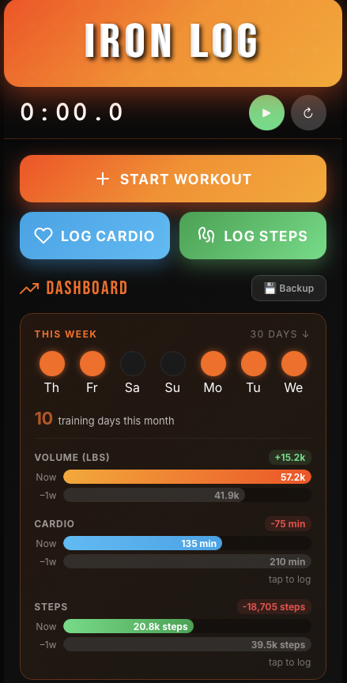
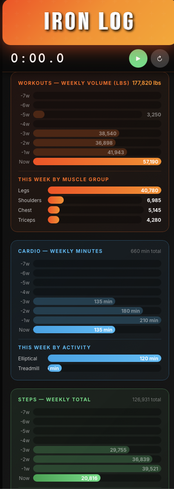
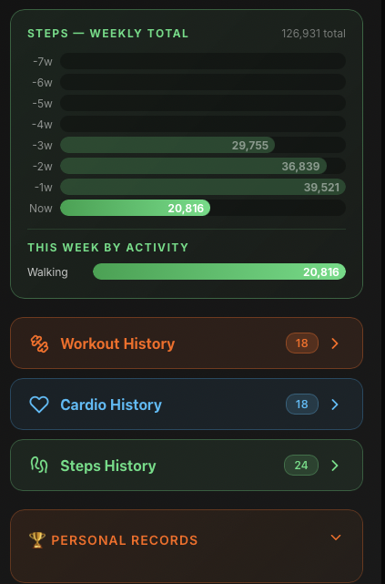
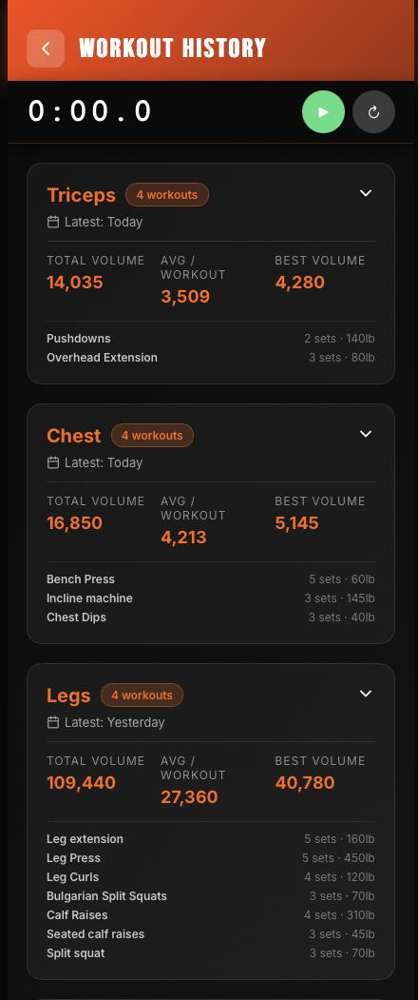
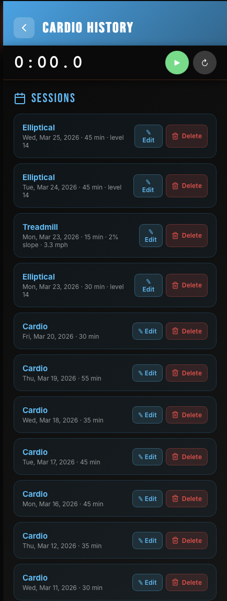
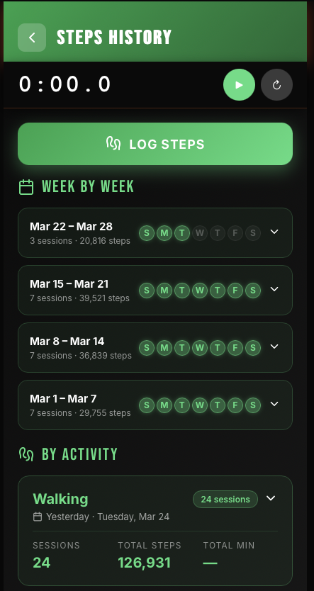

# Iron Log

Simple workout weight tracker — a single HTML file, no server, no install. Runs entirely in your browser with localStorage.

## Screenshots

### Dashboard

  

*Main dashboard · Weekly volume, cardio & steps charts · History nav*

---

### History Views

  

*Workout history · Cardio history · Steps history*

## Features

- Log workouts by muscle group with sets, reps, and weight
- Track cardio sessions (treadmill, elliptical, walking, running)
- Log daily steps
- Weekly volume bar charts for workouts, cardio, and steps
- Personal records tracking per exercise
- Plate calculator
- Drop sets and supersets
- Backup / restore via JSON export

## Usage

Open `index.html` in any browser. No dependencies, no build step.

## Data

All data is stored in `localStorage`. Use the Backup button to export a JSON file — import it on any device to restore.
